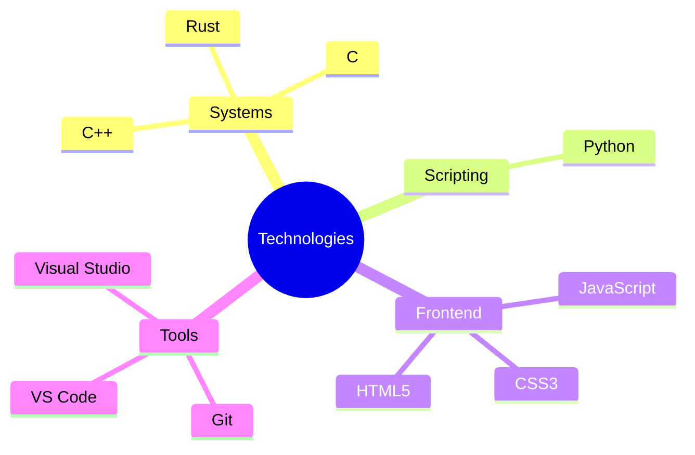

# Hi there! I'm Joseph

  
  
  

## About Me
20-year-old developer passionate about systems programming, desktop software, and crafting polished user experiences. I love pushing the limits of what native applications can look and feel like.

## Tech Stack

## GitHub Metrics

  
  

## Trophies

## Contribution Activity

## Contact

| Method | Contact |
|--------|---------|
| GitHub | [hazedxz](https://github.com/hazedxz) |

---

  

